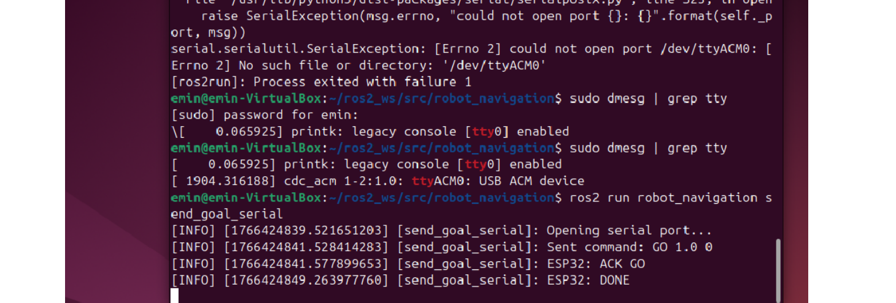
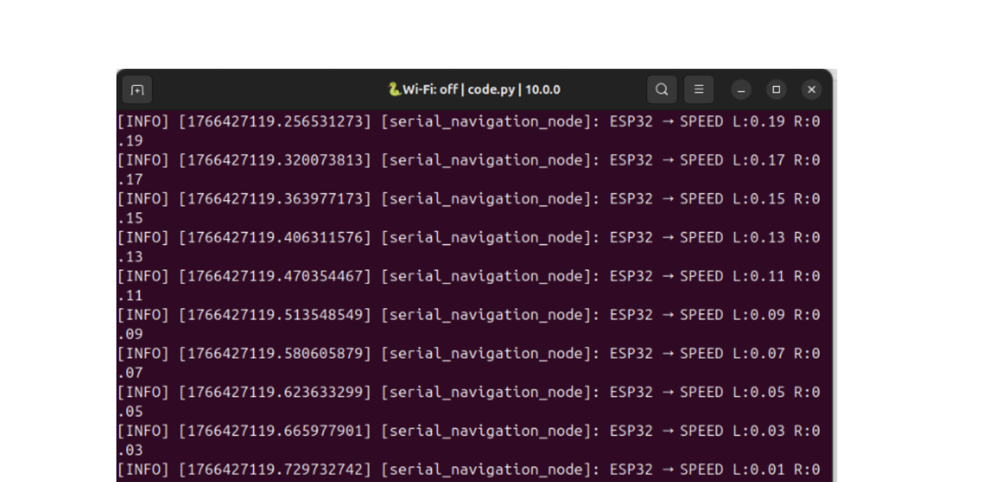
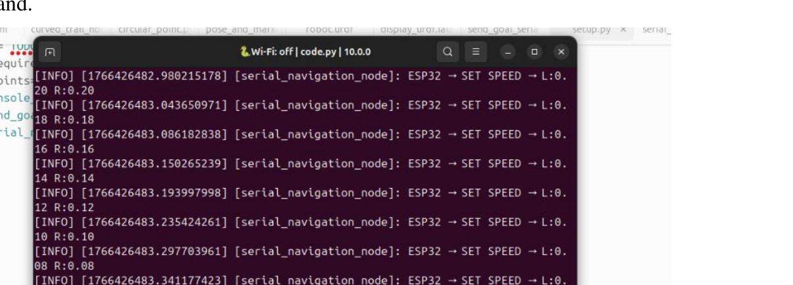

#  robot_navigation

> **ROS2-based autonomous mobile robot** — obstacle avoidance, path planning, and real-time serial control over an ESP32 microcontroller.

[](https://docs.ros.org/)
[](https://circuitpython.org/)
[](https://www.espressif.com/)
[](LICENSE)

---

##  Demo

| ROS2 Command & ACK | Soft Deceleration Log |
|---|---|
|  |  |

**Motor speed stepping down during deceleration phase:**



---

##  Overview

This project implements a complete **autonomous navigation stack** for a differential-drive robot, running on commodity hardware — a laptop running ROS2 and an ESP32 microcontroller. The robot navigates from a start position **A** to a goal position **B**, avoiding obstacles detected by an infrared sensor, all without wheel encoders or GPS.

Because the robot lacks odometry sensors, reliable motion is achieved through three complementary techniques:

- **Soft acceleration / deceleration** — ramps motor speed gradually to eliminate wheel slip at start and stop
- **Time-based dead reckoning** — estimates distance from elapsed time and a calibrated speed constant
- **Tape marker correction** — an IR sensor detects physical reference markers on the floor and snaps the distance estimate to a known value, preventing drift accumulation over time

Two distinct obstacle avoidance strategies are implemented and compared, making this a practical study in reactive vs. deliberate robot control.

---

##  Features

-  **ROS2 ↔ ESP32 serial bridge** — clean ASCII command/response protocol over USB
-  **Rotation + forward motion** — heading (degrees) and distance (metres) commanded from ROS2
-  **Smooth motion profile** — configurable acceleration step, min/max speed, and loop rate
-  **Dual-mode tape detection** — short IR pulse = distance marker, long pulse = obstacle
-  **Two obstacle avoidance algorithms** — reactive steering and state-based stop-and-rotate
-  **Modular firmware** — three interchangeable ESP32 scripts, swap by renaming to `code.py`
-  **Structured ROS2 logging** — every speed command and state transition logged with timestamps

---

##  System Architecture

```
┌─────────────────────────────────┐       USB Serial (115200 baud)
│          Laptop (Ubuntu)        │ ─────────────────────────────────►  ┌──────────────────┐
│                                 │  GO <distance> <heading>\n           │      ESP32        │
│  ┌──────────────────────────┐   │ ◄─────────────────────────────────── │                  │
│  │   ROS2 Control Node      │   │  ACK GO / SPEED L:x R:y / DONE      │  ┌─────────────┐ │
│  │  (send_goal_serial.py)   │   │                                       │  │ Motor Driver│ │
│  └──────────────────────────┘   │                                       │  └──────┬──────┘ │
└─────────────────────────────────┘                                       │  ┌──────▼──────┐ │
                                                                          │  │ 2× DC Motors│ │
                                                                          │  └─────────────┘ │
                                                                          │  ┌─────────────┐ │
                                                                          │  │TCRT5000 IR  │ │
                                                                          │  └─────────────┘ │
                                                                          └──────────────────┘
```

### ESP32 State Machine

```
         ┌──────────────────────────────────────────────┐
         │                                              │
   ┌─────▼──────┐    GO cmd    ┌──────────┐            │
   │    IDLE    │ ────────────► │  ROTATE  │            │
   └────────────┘              └────┬─────┘            │
         ▲                         │ heading done      │
         │                    ┌────▼──────┐            │
         │                    │   MOVE    │            │
         │                    └─────┬─────┘            │
       DONE                        │                   │
         │             ┌───────────┴──────────┐        │
         │        tape │                      │ dist   │
         │        long │                  reached      │
         │        ┌────▼──────┐        ┌─────▼─────┐  │
         └─────── │   STOP    │◄───────│   AVOID   │  │
                  └───────────┘        └───────────┘  │
                       │                              │
                       └──────────────────────────────┘
```

---

##  Repository Structure

```
robot_navigation/
├── robot_navigation/
│   ├── send_goal_serial.py       # ROS2 node — sends GO commands, reads responses
│   ├── serial_navigation_node.py # ROS2 node — live serial monitor / logger
│   ├── code_basic.py             # ESP32: basic motion only, no obstacle avoidance
│   ├── code_reactive.py          # ESP32: reactive steering avoidance
│   └── code_statebased.py        # ESP32: state-based stop-and-rotate avoidance
├── images/
│   ├── ros2_command.png
│   ├── soft_accel.png
│   └── soft_decel.png
├── package.xml
├── setup.cfg
└── setup.py
```

---

##  Hardware

| Component | Details |
|-----------|---------|
| Computer | Ubuntu Linux with ROS2 |
| Microcontroller | ESP32 running CircuitPython |
| Drive system | 2× DC motors with H-bridge driver |
| Sensor | TCRT5000 infrared reflectance sensor |
| Interface | USB CDC (appears as `/dev/ttyACM0`) |

**Pin mapping:**

| Signal | ESP32 Pin |
|--------|-----------|
| Left motor PWM A | IO5 |
| Left motor PWM B | IO6 |
| Right motor PWM A | IO7 |
| Right motor PWM B | IO8 |
| TCRT5000 digital input | IO2 |

---

##  Key Parameters

Defined at the top of each firmware file — tune these to match your robot's physical characteristics.

| Parameter | Default | Description |
|-----------|---------|-------------|
| `MAX_SPEED` | `0.6` | Maximum motor throttle (0.0 – 1.0) |
| `MIN_SPEED` | `0.15` | Initial throttle at start of acceleration |
| `ACCEL_STEP` | `0.02` | Speed increment per control tick |
| `LINEAR_SPEED_MPS` | `0.15 m/s` | Assumed forward speed for distance estimation |
| `ANGULAR_SPEED` | `0.4 rad/s` | Assumed rotation speed for heading estimation |
| `DT` | `0.05 s` | Control loop period (20 Hz) |
| `MARKER_TIME` | `0.3 s` | Max tape detection duration to count as a distance marker |
| `AVOID_TURN_TIME` | `0.6 s` | Rotation duration during state-based avoidance |
| `AVOID_LEFT_SCALE` | `0.4` | Left motor scale factor during reactive steering |

---

##  Obstacle Avoidance Algorithms

### Algorithm 1 — Reactive Steering (`code_reactive.py`)

The robot detects an obstacle via the IR sensor and immediately adjusts the left/right motor ratio while **continuing to move forward**. No full stop occurs.

```python
# Steer away by running the left motor slower than the right
left  = current_speed * AVOID_LEFT_SCALE   # 0.4 × speed
right = current_speed * AVOID_RIGHT_SCALE  # 1.0 × speed
set_speed(left, right)
```

|  Pros |  Cons |
|--------|--------|
| Smooth, continuous motion | Can get trapped in tight clusters |
| Fast response, no stopping | Heading drift accumulates |
| Simple to tune | Less predictable path |

**Best for:** open environments with isolated obstacles.

---

### Algorithm 2 — State-Based Stop & Rotate (`code_statebased.py`)

When an obstacle is detected, the robot enters a dedicated `AVOID` state: it **stops completely**, **rotates in place** for a fixed duration, then resumes forward motion.

```python
elif state == "AVOID":
    set_speed(0.4, -0.4)        # rotate in place
    avoid_time += DT
    if avoid_time >= AVOID_TURN_TIME:
        stop()
        state = "MOVE"          # resume forward
```

|  Pros |  Cons |
|--------|--------|
| Reliable in complex layouts | Stop-start motion, not smooth |
| Predictable and repeatable | Slower overall travel time |
| Easy to extend with extra logic | Requires tuning of `AVOID_TURN_TIME` |

**Best for:** cluttered environments with multiple obstacles in sequence.

---

##  Setup & Installation

### Prerequisites

- ROS2 (Humble or Jazzy) installed and sourced
- `pyserial` Python package: `pip install pyserial`
- CircuitPython on the ESP32 with the `adafruit_motor` library bundle installed

### 1. Clone and build

```bash
cd ~/ros2_ws/src
git clone https://github.com/emins1856/robot_navigation.git

cd ~/ros2_ws
colcon build --packages-select robot_navigation
source install/setup.bash
```

### 2. Flash the ESP32

Connect the ESP32 via USB. It mounts as a USB drive under CircuitPython. Copy your chosen firmware and rename it to `code.py` on the drive:

| File | Use when |
|------|----------|
| `code_basic.py` | Testing motion only, no obstacles |
| `code_reactive.py` | Simple / open environment |
| `code_statebased.py` | Complex / cluttered environment |

### 3. Verify the serial port

```bash
sudo dmesg | grep tty
# Expected: cdc_acm ... ttyACM0: USB ACM device
```

If you see a different port (e.g. `ttyACM1`), update `self.port` in `send_goal_serial.py`.

### 4. Run

```bash
ros2 run robot_navigation send_goal_serial
```

Edit `distance` and `heading` in `send_goal_serial.py` before running to change the movement goal.

---

##  Serial Protocol

All messages are plain ASCII, newline-terminated (`\n`).

### PC → ESP32

| Command | Description |
|---------|-------------|
| `GO <dist_m> <heading_deg>` | Rotate to heading, then drive the given distance |

**Example:** `GO 2.0 90` — rotate 90°, then drive 2 metres forward.

### ESP32 → PC

| Message | Meaning |
|---------|---------|
| `ESP32 READY` | Firmware booted, awaiting commands |
| `ACK GO` | Command accepted, beginning execution |
| `SPEED L:<val> R:<val>` | Live motor throttle values streamed during motion |
| `MARKER` | Distance marker tape detected, estimate corrected |
| `OBSTACLE` | Obstacle tape detected, avoidance triggered |
| `DONE` | Goal reached, back to IDLE |
| `BAD COMMAND` | Malformed or unrecognised command received |

---

##  Testing Checklist

- [x] Serial port opens and `ESP32 READY` received
- [x] `GO` command sent and `ACK GO` returned
- [x] Robot rotates to heading before moving forward
- [x] Motor speed ramps smoothly from `MIN_SPEED` to `MAX_SPEED`
- [x] Distance markers trigger estimate correction (`MARKER` logged)
- [x] Obstacles trigger avoidance behaviour (`OBSTACLE` logged)
- [x] Motor speed ramps down gracefully at goal distance
- [x] `DONE` received after every successful run
- [x] No abrupt stops or jerky motion at any phase

---

##  Limitations & Future Work

| Current Limitation | Potential Improvement |
|--------------------|-----------------------|
| No wheel encoders — distance is estimated only | Add optical encoders for true odometry |
| Fixed avoidance rotation time | Compute turn angle from obstacle geometry |
| Single IR sensor — no left/right awareness | Add flanking IR sensors for directional avoidance |
| Speed assumptions vary with battery charge | Closed-loop speed control with encoder feedback |
| No global map or replanning | Integrate Nav2 for full autonomous navigation stack |

---

##  Tech Stack

| Layer | Technology |
|-------|-----------|
| Robot middleware | [ROS2](https://docs.ros.org/) (Humble / Jazzy) |
| ROS2 language | Python 3 (`rclpy`) |
| Microcontroller | ESP32 |
| Firmware language | [CircuitPython](https://circuitpython.org/) |
| Motor library | [adafruit_motor](https://docs.circuitpython.org/projects/motor/en/latest/) |
| Serial (PC side) | `pyserial` |
| Serial (ESP32 side) | `usb_cdc` |
| Build system | `colcon` |

---

## Author
Emin Samadov
Software Engineering (Robotics Systems) — Vilnius University
GitHub: github.com/emins1856

---

##  License

This project is open source under the [MIT License](LICENSE).
